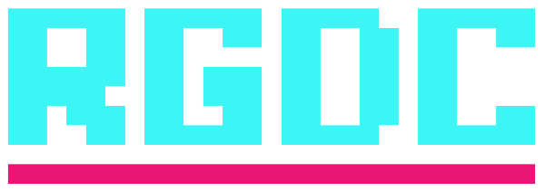

## <i class="material-icons">help_outline</i> Who are we?

RIT Game Dev club provides an open, creative, learning environment for students passionate about game development with weekly presentations on various topics and game jams every semester

## <i class="material-icons">accessibility_new</i> But... I don't know how to make games?

There is no prior knowledge required to come to the club! New members are always welcome, from Computer Science to Imaging Science. 

<!-- List of events -->
## <i class="material-icons">date_range</i> Upcoming Events



### {{ item.title }}



####  {{ item.time }} in {{ item.location }}






{{ item.description }}

 <!-- End of Event data -->

## <i class="material-icons">chat</i> Come and chat! 

<iframe src="https://discordapp.com/widget?id=377989609205792778&theme=dark" width="350" height="500" allowtransparency="true" frameborder="0"></iframe>

<!---
## <i class="material-icons">highlight</i> Meeting Topics




### {{ item.title }} 







{{ item.description }}


 
--->